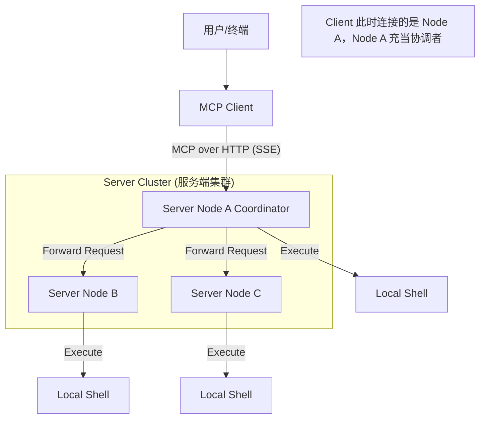
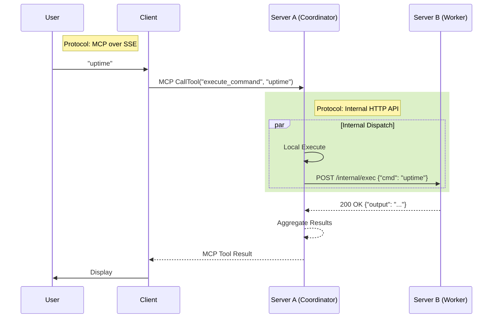
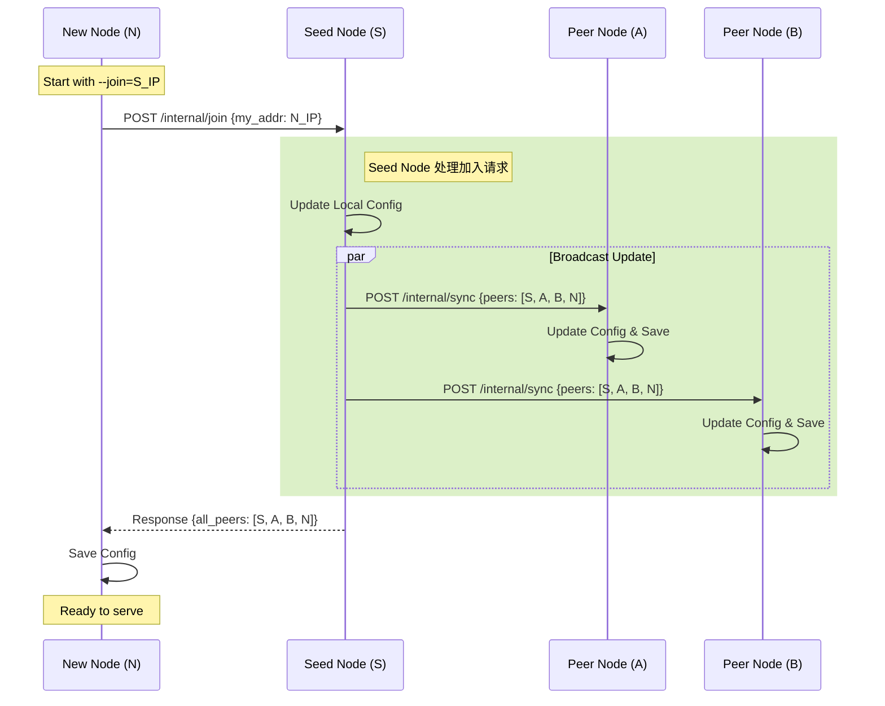

# 架构设计文档：Shell Executor MCP System

## 1. 系统架构图



## 2. 模块划分

### 2.1 Client 模块
- **Config Manager**: 加载服务器列表配置。
- **Connection Manager**: 负责探测并建立与 Server 的连接（MCP Client over SSE）。
- **Input Handler**: 处理用户在终端的输入。
- **MCP Client**: 封装 `go-sdk` 的 Client 功能，发送 `CallTool` 请求。

### 2.2 Server 模块
- **MCP Server Core**: 基于 `go-sdk` 实现，注册 Tool `execute_command`。
- **Security Guard (安全卫士)**: 
  - 负责对输入命令进行安全审计。
  - 实现基于规则和正则的拦截算法。
- **Command Executor (执行器)**:
  - 封装 `os/exec`，执行本地 Shell 命令。
  - 捕获 Stdout 和 Stderr。
- **Cluster Dispatcher (集群分发器)**:
  - 维护 Peer 节点列表。
  - 负责将命令分发给其他节点（充当其他节点的 Client）。
  - 聚合本地和其他节点的执行结果。

## 3. 核心流程设计

### 3.1 去中心化协调机制 (Decentralized Coordinator)
- **无主架构**: 集群中不存在固定的 Master/Leader。
- **角色动态分配**: 任何接收到 Client 直接请求的 Server 节点，自动承担 **Coordinator** 角色。其他被 Coordinator 调用的节点承担 **Worker** 角色。
- **通信协议**: 
  - **Client -> Server**: MCP over HTTP (SSE)。
  - **Server -> Server**: Internal HTTP JSON API。

### 3.2 Server 间通信协议 (Internal Communication)

为了明确区分“面向 Client 的 MCP 业务”和“面向 Server 的集群管理”，Server 间通信**不再复用 MCP 协议**，而是采用 **标准 HTTP JSON API**。

- **Endpoint 设计**:
  - `POST /internal/exec`: Coordinator 分发命令给 Worker。Request: `{"cmd": "..."}`.
  - `POST /internal/join`: 新节点申请加入集群。
  - `POST /internal/sync`: 广播同步节点列表。
- **端口**: 默认与 MCP 服务复用端口（通过路径区分），也可配置独立端口以增强安全。
- **鉴权**: 内部 API 建议配置 Shared Secret Token (Header `X-Cluster-Token`) 以防止未授权访问。

### 3.3 时序图：混合协议交互



### 3.4 动态成员管理与配置同步 (Membership Protocol)

采用 HTTP API 实现。

#### 3.4.1 节点加入流程 (Join Process)

1. **启动**: 新节点 (Node N) 启动。
2. **请求**: Node N -> Node S: `POST /internal/join`。
3. **广播**: Node S -> Node A, Node B...: `POST /internal/sync`。
4. **同步**: 
   - 其他节点收到 `sync`，更新本地列表并持久化。
   - Node S 返回完整列表给 Node N。

### 3.5 时序图：新节点加入 (Node Join Sequence)



### 3.6 故障处理
- **Coordinator 宕机**: 
  - Client 检测到连接断开或请求超时。
  - Client 报错 "Coordinator unreachable"，并自动尝试连接列表中的下一个 Server。
  - **任务状态**: 此时任务状态为“未知”。由于 Shell 命令可能非幂等，**不进行自动重试**，需用户手动再次提交。
- **Worker 宕机**: 
  - Coordinator 设置了请求超时（如 5s）。
  - 超时后，Coordinator 将该 Worker 标记为 "Failed/Timeout"，不影响其他节点的执行结果。

## 4. 详细算法设计

### 4.1 安全检查算法
采用 **"黑名单 + 启发式检查"** 策略。

**Config**:
```json
{
  "blacklisted_commands": ["rm", "mkfs", "dd", "reboot", "shutdown", ":(){:|:&};:"],
  "dangerous_args": ["-rf /", "> /dev/sda"]
}
```

**Algorithm**:
1. **Trim & Normalize**: 去除首尾空格，将多余空格压缩。
2. **Tokenize**: 按空格分割命令，提取第一个 Token 作为 `CommandVerb`。
3. **Verb Check**: 检查 `CommandVerb` 是否在 `blacklisted_commands` 中。
4. **Args Check**: 如果 `CommandVerb` 敏感但未完全禁止（如 `rm`），检查参数是否包含 `dangerous_args` 中的模式（正则匹配）。
5. **Result**: Pass or Block。

### 4.2 集群聚合算法 (Scatter-Gather with Compression)

为了支持大规模节点并提高效率，采用 **"Worker Pool 并发 + 结果哈希分组"** 策略。

1. **初始化**:
   - `ResultChan`: 用于接收 `NodeResult`。
   - `WorkerPool`: 限制并发数为 `N` (e.g., 50)，防止 FD 耗尽。

2. **分发 (Scatter)**:
   - 遍历 Peer 列表，将任务提交给 Worker Pool。
   - 每个 Worker:
     - 创建 HTTP Client。
     - 发送 `POST /internal/exec` 请求，设置 `Timeout` (e.g., 5s)。
     - 无论成功失败，都将结果写入 `ResultChan`。
   - 同时，本地执行任务也作为一个特殊的 Worker 运行。

3. **聚合与压缩 (Gather & Compress)**:
   - 收集所有 `NodeResult`。
   - **指纹计算**: 对每个 Result 的 `Stdout + Stderr + Status` 计算 Hash (SHA256 或简单字符串 Key)。
   - **分组**: 维护一个 Map `Hash -> AggregatedGroup`。
     ```go
     type AggregatedGroup struct {
         Output string
         Error  string
         Status string
         Nodes  []string // 属于该组的节点名称列表
     }
     ```
   - 将同一组的节点合并。

4. **响应**: 将 Map 转换为 List 返回给 Client。

## 5. 数据结构

### 5.1 MCP Tool Schema
```json
{
  "name": "execute_command",
  "description": "Execute a shell command on the cluster",
  "inputSchema": {
    "type": "object",
    "properties": {
      "command": { "type": "string", "description": "The shell command to execute" }
    },
    "required": ["command"]
  }
}
```

### 5.2 响应结构 (Optimized)
返回聚合后的结果组，极大减少冗余数据。

```json
{
  "summary": "Executed on 100 nodes, 3 groups found",
  "groups": [
    {
      "nodes": ["node-01", "node-02", "...", "node-98"],
      "count": 98,
      "status": "success",
      "output": "v1.0.0\n",
      "error": ""
    },
    {
      "nodes": ["node-99"],
      "count": 1,
      "status": "failed",
      "output": "",
      "error": "connection timeout"
    },
    {
      "nodes": ["node-100"],
      "count": 1,
      "status": "success",
      "output": "v1.0.1-beta\n", // 版本不一致的节点被单独分组
      "error": ""
    }
  ]
}
```
